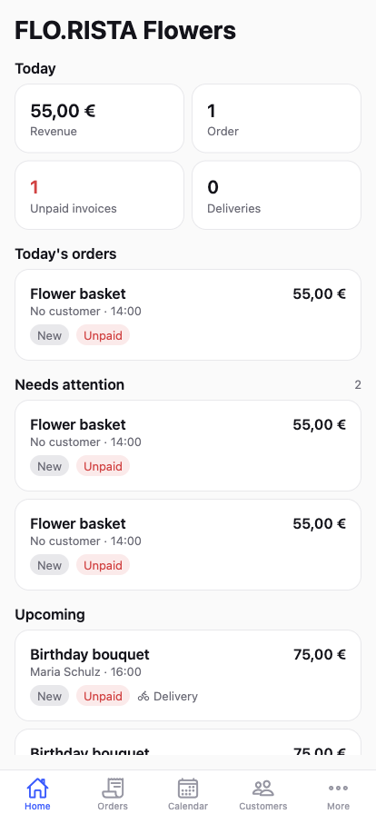
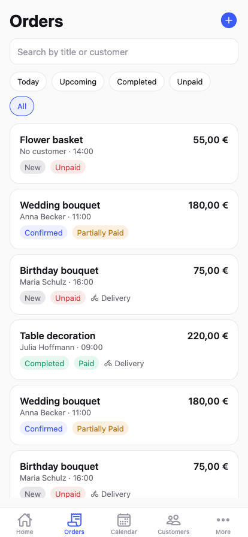
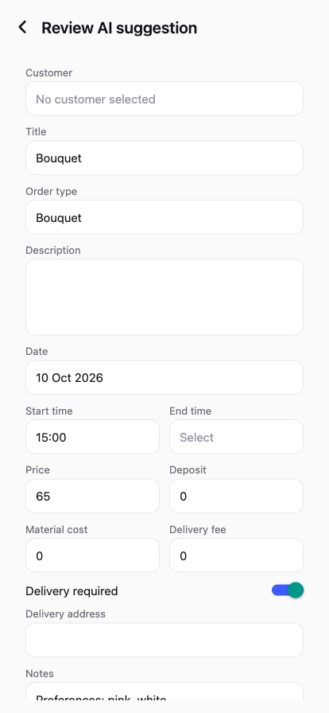
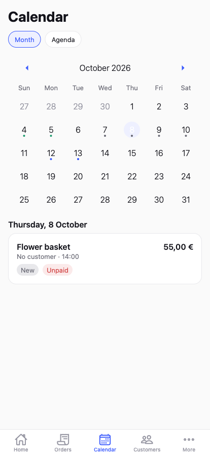

# auftragQ

A mobile business assistant for solo entrepreneurs and small service businesses
(florists, decorators, photographers, cleaners, beauty professionals, event
vendors) — turn customer requests into structured orders, track payments and
appointments, and use AI to save time on repetitive writing.

**Status:** MVP in active development — Phases 1–6 of 9 complete (auth, customers,
orders, dashboard, calendar, AI order creation). See [Roadmap](#roadmap).

|                                           |                                               |
| ----------------------------------------- | --------------------------------------------- |
|  |  |
|  |  |

## Stack

Expo (SDK 57) · Expo Router · TypeScript (strict) · Supabase (Auth/Postgres/Storage)
· TanStack Query · Zustand · React Hook Form + Zod · Expo Secure Store · Expo
Notifications · Expo Image Picker

## Getting started

```bash
npm install
cp .env.example .env   # fill in your Supabase project URL + anon key
npm start
```

Apply the database schema in `supabase/migrations/0001_init.sql` to your
Supabase project — see `supabase/README.md`.

## Scripts

| Command | Description |
| --- | --- |
| `npm start` | Start the Expo dev server |
| `npm run ios` / `android` / `web` | Start on a specific platform |
| `npm run lint` | ESLint |
| `npm run format` | Prettier, write mode |
| `npm run typecheck` | `tsc --noEmit` |
| `npm test` | Vitest (business logic: validation, profit calc, parsing) |

## Project structure

```
src/
  app/            Expo Router routes (thin screens only)
    (auth)/       login, register, forgot/reset password
    (onboarding)/ business-setup
    (app)/(tabs)/ Home, Orders, Calendar, Customers, More
  components/     Reusable UI primitives (Button, Input, Card, ...)
  features/       Business logic + API calls, grouped by domain
  lib/supabase/   Supabase client, DB types
  providers/      App-wide context (session, query client)
  theme/          Design tokens (colors, spacing, typography)
  types/          Shared domain types
  utils/          Pure helpers (currency, dates, error messages)
supabase/
  migrations/     SQL schema + Row Level Security policies
  functions/      AI Edge Functions (provider-independent AIProvider interface)
```

Business logic lives in `features/`, not in screen components under `app/`.

## Security

- Row Level Security is enabled on every table; a user can only ever read or
  write their own rows (`auth.uid()` scoping) — see `supabase/migrations/0001_init.sql`.
- The mobile client never calls an LLM provider directly. AI features call a
  server-side abstraction (Supabase Edge Functions in `supabase/functions/`)
  that holds provider keys — see `supabase/README.md` for deployment.
- Supabase credentials in `.env` are the public anon key, safe to ship — RLS
  is what actually protects the data.

## Roadmap

Built in phases, each on its own branch off `develop`:

1. ✅ Project setup — Expo Router, auth, onboarding, Supabase, DB schema.
2. ✅ Customers CRUD
3. ✅ Orders CRUD
4. ✅ Dashboard
5. ✅ Calendar
6. ✅ AI Create Order (text → structured order via server-side AI service) + Generate Reply
7. Order images (Supabase Storage)
8. Notifications (local reminders)
9. UI polish

## Branching workflow

Every feature or bugfix branches off `develop`, gets a PR back into `develop`,
and `main` only receives releases from `develop`.
